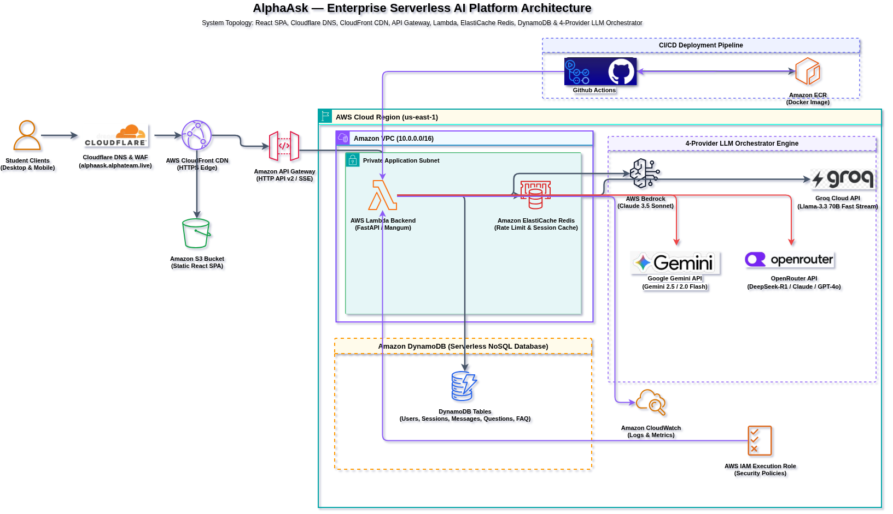

# AlphaAsk — AI-Powered Student Support Platform

**AlphaAsk** is an enterprise-grade, fully serverless AI academic support platform for university students. It features a React 19 SPA, Cloudflare DNS & WAF edge security, AWS CloudFront CDN, a FastAPI backend on AWS Lambda, DynamoDB NoSQL persistence, ElastiCache Redis rate-limiting, a **4-provider LLM failover engine** (OpenRouter → Groq → Gemini → Bedrock), **real-time SSE word-by-word streaming**, **RAG Strict Grounding Mode**, **AI-powered Flashcard generation**, **Pomodoro Study Timer**, **Citation Management**, and a full academic study toolkit.

---

## 1. System Architecture



- **Full Draw.io Source**: [docs/alphaask-architecture.drawio](docs/alphaask-architecture.drawio)
- **Architecture Overview**: [docs/SYSTEM_ARCHITECTURE_AND_WORKFLOW.md](docs/SYSTEM_ARCHITECTURE_AND_WORKFLOW.md)

---

## 2. Technology Stack

### Frontend
| Layer | Technology |
|---|---|
| **Framework** | React 19 + TypeScript, bundled via Vite |
| **Styling** | Vanilla CSS design system — custom properties, dark/light theme tokens, IBM Plex Sans typography |
| **Markdown Rendering** | `react-markdown` for headers, lists, code blocks, blockquotes |
| **Icons** | Lucide React (Send, Plus, LogIn, BookOpen, Bookmark, FolderKanban, Sparkles, etc.) |
| **UUID Generation** | `generateUUID()` with Web Crypto API + cross-browser fallback |
| **Testing** | Vitest + React Testing Library (6/6 tests passing) |

### Backend
| Layer | Technology |
|---|---|
| **Framework** | FastAPI (Python 3.12) + Uvicorn ASGI server |
| **Serverless Adapter** | Mangum — wraps FastAPI for AWS Lambda execution |
| **Authentication** | JWT (HS256, 8-hour expiry) via `python-jose` + `bcrypt` password hashing via `passlib` |
| **Config** | Pydantic v2 `BaseSettings` with `.env` file loading |
| **PDF Processing** | `pypdf` — page-by-page text extraction with fallback regex parsers |
| **Rate Limiting** | Redis sliding-window (10 requests/minute/user); fallback to in-memory |
| **Testing** | Pytest (4 test modules: `test_api`, `test_ask`, `test_history`, `test_signup`) |

### AWS Infrastructure (Terraform-managed)
| Service | Role | Terraform File |
|---|---|---|
| **Amazon API Gateway** | HTTP API v2 — public HTTPS entry point (`ANY /{proxy+}`) | `lambda_apigw.tf` |
| **AWS Lambda** | Serverless FastAPI execution (container image) | `lambda_apigw.tf` |
| **Amazon ECR** | Docker container image registry | `ecr.tf` |
| **Amazon DynamoDB** | 5 on-demand NoSQL tables (see below) | `dynamodb.tf` |
| **Amazon ElastiCache** | Redis rate-limiting cache | `elasticache.tf` |
| **Amazon S3** | Static React SPA hosting (CDN origin) | `s3_cloudfront.tf` |
| **AWS CloudFront** | CDN distribution for static frontend assets | `s3_cloudfront.tf` |
| **AWS IAM** | Lambda execution role with scoped DynamoDB + Bedrock + ECR permissions | `iam.tf` |
| **Cloudflare DNS/WAF** | Global DNS (`alphaask.alphateam.live`) + edge WAF security | External |

### AI Orchestration — 4-Provider Failover Engine
The failover cascade executes in this exact order (verified from `llm_services.py`):

| Priority | Provider | Model(s) | Mode |
|:---:|---|---|---|
| **1st** | **OpenRouter API** | `openai/gpt-4o-mini` (default) + discipline-routed models | Sync + Native SSE streaming |
| **2nd** | **Groq Cloud API** | `llama-3.3-70b-versatile` | Sync + Native SSE streaming |
| **3rd** | **Google Gemini API** | `gemini-2.5-flash`, `gemini-2.0-flash`, `gemini-1.5-flash` | Sync (chunked word emit) |
| **4th** | **AWS Bedrock** | `us.anthropic.claude-3-5-sonnet-20241022-v2:0` | Sync (chunked word emit) |

#### Subject-Discipline Model Routing (OpenRouter)
| Discipline | Primary Model | Fallbacks |
|---|---|---|
| **Math** | `deepseek/deepseek-r1` | `openai/gpt-4o` → `meta-llama/llama-3.3-70b-instruct` → `openai/gpt-4o-mini` |
| **Writing & Humanities** | `anthropic/claude-3.5-sonnet` | `openai/gpt-4o` → `google/gemini-2.0-flash-001` → `openai/gpt-4o-mini` |
| **Code & CS** | `qwen/qwen-2.5-coder-32b-instruct` | `meta-llama/llama-3.3-70b-instruct` → `deepseek/deepseek-r1` → `openai/gpt-4o-mini` |
| **Science** | `google/gemini-2.0-flash-001` | `deepseek/deepseek-r1` → `anthropic/claude-3.5-sonnet` → `openai/gpt-4o-mini` |
| **History & Social Sciences** | `anthropic/claude-3.5-sonnet` | `openai/gpt-4o` → `meta-llama/llama-3.3-70b-instruct` → `openai/gpt-4o-mini` |
| **Study Strategy** | `openai/gpt-4o-mini` | `google/gemini-2.0-flash-001` → `meta-llama/llama-3.3-70b-instruct` |

---

## 3. Platform Features & Components

### Core Chat & AI Features
| Feature | Details |
|---|---|
| **Real-Time SSE Streaming** | Word-by-word streaming via `POST /api/ask/stream` using OpenAI-compatible chunked HTTP SSE. Native streaming on OpenRouter and Groq; word-chunk fallback on Gemini/Bedrock. |
| **Synchronous Q&A** | `POST /api/ask` — full response with DynamoDB persistence to Messages + Questions tables |
| **6 Academic Personas** | `math`, `science`, `writing`, `code`, `history`, `study` — each injects discipline-specific system prompt instructions |
| **RAG Strict Grounding** | `rag_mode=true` — chunks documents (1,500 chars, 200 overlap, top-5 relevance scoring), enforces `RAG_SYSTEM_PROMPT` anti-hallucination rules, mandates citations |
| **Document & PDF Upload** | `pypdf`-powered server-side extraction; client-side regex fallback; supports `.pdf`, `.txt`, `.md`, `.docx`; max 60,000 chars injected |
| **Conversation Memory** | Full session history passed as message context to LLM on every request |
| **ThinkingIndicator** | Animated "thinking" state shown while LLM generates response |

### Study Toolkit (Frontend Components)
| Component | File | Feature |
|---|---|---|
| **SubjectsModal** | `SubjectsModal.tsx` | 6-discipline taxonomy explorer — click any subject to inject a targeted prompt |
| **FlashcardModal** | `FlashcardModal.tsx` | AI-powered flashcard generation from chat content or uploaded notes |
| **PomodoroTimer** | `PomodoroTimer.tsx` | Built-in Pomodoro study timer (25/5 minute work/break cycles) |
| **CitationModal** | `CitationModal.tsx` | Academic citation manager (APA/MLA format generation) |
| **ClassesModal** | `ClassesModal.tsx` | Course workspace manager — enroll in courses (`CS 301`, `MATH 202`), switch active course context; persisted in `localStorage` |
| **SavedAnswersModal** | `SavedAnswersModal.tsx` | Bookmark AI responses, full-text search, copy-to-clipboard; persisted in `localStorage` |
| **QuestionManagement** | `QuestionManagement.tsx` | View, search, and delete user question history (calls `GET/DELETE /api/questions`) |
| **FAQ** | `FAQ.tsx` | Frequently Asked Questions viewer (calls `GET /api/FAQ`) |
| **MoreModal** | `MoreModal.tsx` | Multi-provider AI diagnostics, keyboard shortcuts, and academic integrity guide |

### Session & Auth
| Component | File | Feature |
|---|---|---|
| **AuthModal** | `AuthModal.tsx` | Login and registration forms with show/hide password toggle |
| **TopBar** | `TopBar.tsx` | Top navigation — theme toggle (dark/light), auth controls, session info |
| **Sidebar** | `Sidebar.tsx` | Collapsible sidebar — conversation list, new chat, study toolkit launchers |
| **Hero** | `Hero.tsx` | Landing hero section for unauthenticated users |
| **Composer** | `Composer.tsx` | Message input area — file attachment button, RAG mode toggle, send button |
| **MessageThread** | `MessageThread.tsx` | Scrollable message history thread |
| **MessageRow** | `MessageRow.tsx` | Individual message bubble with markdown rendering, copy, and save-answer actions |

---

## 4. DynamoDB Table Schema

| Table Name | Key Schema | GSI | Purpose |
|---|---|---|---|
| `alphaask-Users` | PK: `user_id` | — | User credentials & account data |
| `alphaask-Sessions` | PK: `session_id` | — | Active chat sessions with `user_id` |
| `alphaask-Messages` | PK: `message_id` | — | Full timestamped message exchange history |
| `alphaask-Questions` | PK: `id` | `UserQuestionsIndex` (PK: `user_id`) | Question history with O(1) user-scoped lookup |
| `alphaask-FAQ` | PK: `id` | — | Static FAQ entries (served from inline seed data) |

---

## 5. Repository Structure

```
alphaask/
├── backend/
│   ├── app/
│   │   ├── api/              # FastAPI route handlers
│   │   │   ├── ask.py        # POST /ask + POST /ask/stream (SSE)
│   │   │   ├── auth.py       # POST /auth/register + POST /auth/login
│   │   │   ├── health.py     # GET /health
│   │   │   ├── history.py    # GET /conversations + GET /history/{session_id}
│   │   │   ├── questions.py  # CRUD /questions + GET /FAQ
│   │   │   └── sessions.py   # POST /sessions
│   │   ├── core/
│   │   │   ├── config.py     # Pydantic v2 Settings (env vars, table names, API keys)
│   │   │   ├── deps.py       # JWT dependency injection (get_current_user)
│   │   │   ├── rate_limit.py # Redis sliding-window rate limiter (10 req/min)
│   │   │   └── security.py   # bcrypt hash/verify + JWT create/decode
│   │   ├── db/
│   │   │   └── dynamodb.py   # DynamoDB service (all CRUD operations)
│   │   ├── schemas/
│   │   │   └── ask.py        # Pydantic request/response schemas
│   │   ├── services/
│   │   │   ├── llm_services.py          # 4-provider LLM engine, RAG, PDF parsing, streaming
│   │   │   └── conversation_service.py  # Conversation history helpers
│   │   └── main.py           # FastAPI app + CORS + Mangum handler
│   ├── tests/
│   │   ├── conftest.py       # Pytest fixtures (mock DynamoDB, test client)
│   │   ├── test_api.py       # Health & sessions route tests
│   │   ├── test_ask.py       # /ask endpoint tests (sync + stream)
│   │   ├── test_history.py   # /conversations + /history route tests
│   │   └── test_signup.py    # /auth/register + /auth/login tests
│   ├── Dockerfile            # Multi-stage OCI container for AWS Lambda (linux/amd64)
│   └── requirements.txt
├── frontend/
│   ├── src/
│   │   ├── components/       # 18 React components (see Feature list above)
│   │   ├── hooks/
│   │   │   └── useChat.ts    # Core chat hook — SSE reader, PDF parser, session mgmt
│   │   ├── lib/
│   │   │   ├── api.ts        # REST + SSE API client (VITE_API_BASE_URL aware)
│   │   │   └── utils.ts      # generateUUID() with Web Crypto fallback
│   │   ├── types/            # TypeScript type definitions
│   │   ├── styles/           # Global CSS design tokens
│   │   ├── App.tsx           # Root application component (1,210 lines)
│   │   └── main.tsx          # React DOM entry point
│   ├── vite.config.ts        # Vite config + dev server proxy (/api → localhost:8000)
│   └── package.json
├── infra/
│   └── terraform/
│       ├── main.tf           # AWS provider + region config
│       ├── variables.tf      # Input variable declarations
│       ├── outputs.tf        # api_gateway_url, lambda_arn, cloudfront_url outputs
│       ├── lambda_apigw.tf   # Lambda function + API Gateway HTTP v2 integration
│       ├── dynamodb.tf       # 5 DynamoDB tables (Users, Sessions, Messages, Questions, FAQ)
│       ├── ecr.tf            # ECR repository for Docker image
│       ├── elasticache.tf    # ElastiCache Redis cluster + subnet group
│       ├── s3_cloudfront.tf  # S3 static bucket + CloudFront distribution
│       └── iam.tf            # Lambda execution role + policy (DynamoDB, ECR, Bedrock, Logs)
├── .github/
│   └── workflows/
│       ├── deploy.yml        # 4-stage CI/CD: lint → test → ECR build → Terraform deploy
│       └── destroy.yml       # Infrastructure teardown workflow
└── docs/
    ├── alphaask-architecture.drawio.png          # Architecture diagram (PNG export)
    ├── alphaask-architecture.drawio              # Draw.io source file
    ├── SYSTEM_ARCHITECTURE_AND_WORKFLOW.md       # Full system spec
    ├── CHALLENGES_AND_SOLUTIONS.md               # 14 technical challenges & resolutions
    ├── LOCAL_TESTING_AND_TERRAFORM_GUIDE.md      # Local dev + Terraform setup guide
    ├── DEMO_PRESENTATION_GUIDE.md                # Presentation script & Q&A playbook
    └── DOCKER_SERVERLESS_REPORT.md               # Serverless container architecture report
```

---

## 6. API Reference

| Method | Endpoint | Auth | Description |
|:---:|:---|:---:|:---|
| `GET` | `/health` | No | System health check |
| `POST` | `/auth/register` | No | Register new student account → returns JWT |
| `POST` | `/auth/login` | No | Authenticate student → returns JWT |
| `POST` | `/sessions` | Yes | Create a new chat session |
| `GET` | `/conversations` | Yes | List all user sessions |
| `POST` | `/ask` | Yes | Synchronous Q&A (4-provider failover, DynamoDB persist) |
| `POST` | `/ask/stream` | Yes | Real-time SSE word-by-word streaming response |
| `GET` | `/history/{session_id}` | Yes | Get full conversation history for a session |
| `GET` | `/questions` | Yes | List user's question history (via `UserQuestionsIndex` GSI) |
| `GET` | `/questions/{id}` | Yes | Get a specific question record |
| `DELETE` | `/questions/{id}` | Yes | Delete a question and its associated message |
| `GET` | `/FAQ` | No | Get static FAQ entries |

> All endpoints are mounted at both root (`/endpoint`) and `/api/endpoint` for compatibility with API Gateway proxy routing and local Vite dev server proxy.

---

## 7. Environment Variables

| Variable | Required | Description |
|---|:---:|---|
| `JWT_SECRET_KEY` | ✅ | Secret key for JWT signing (min 32 chars) |
| `AWS_REGION` | ✅ | AWS region (default: `us-east-1`) |
| `AWS_ACCESS_KEY_ID` | ✅ | AWS IAM access key |
| `AWS_SECRET_ACCESS_KEY` | ✅ | AWS IAM secret key |
| `OPENROUTER_API_KEY` | ✅ | OpenRouter API key — enables 1st-priority provider + discipline routing |
| `GROQ_API_KEY` | ✅ | Groq Cloud API key — enables 2nd-priority native SSE streaming |
| `GEMINI_API_KEY` | ✅ | Google Gemini API key — enables 3rd-priority provider |
| `REDIS_URL` | ✅ | Redis connection URL (e.g. `redis://localhost:6379`) |
| `BEDROCK_MODEL_ID` | ⬜ | Override Bedrock model (default: `us.anthropic.claude-3-5-sonnet-20241022-v2:0`) |
| `OPENROUTER_MODEL_ID` | ⬜ | Override default OpenRouter model (default: `openai/gpt-4o-mini`) |
| `RATE_LIMIT_PER_MINUTE` | ⬜ | Requests per minute per user (default: `10`) |
| `JWT_EXPIRE_MINUTES` | ⬜ | JWT token TTL in minutes (default: `480` = 8 hours) |

---

## 8. Local Development Setup

### Backend

```bash
cd backend

# Create & activate virtual environment
python3 -m venv .venv
source .venv/bin/activate

# Install dependencies
pip install -r requirements.txt

# Run automated Pytest backend test suite
pytest

# Launch FastAPI development server (API docs at http://localhost:8000/docs)
uvicorn app.main:app --reload --host 0.0.0.0 --port 8000
```

### Frontend

```bash
cd frontend

# Install dependencies
npm install

# Run Vitest frontend unit test suite
npm test

# Launch Vite dev server (http://localhost:5173)
npm run dev

# Production build
npm run build
```

---

## 9. CI/CD Pipeline (GitHub Actions)

The 4-stage pipeline defined in `.github/workflows/deploy.yml`:

| Stage | Name | Actions |
|:---:|---|---|
| **1** | Lint & Validate | `terraform validate`, `terraform fmt` check |
| **2** | Test | Pytest backend (13 tests) |
| **3** | Build & Push | Docker `linux/amd64` build → ECR push |
| **4** | Deploy | Terraform import (idempotent resource check) → `terraform apply` → inject `VITE_API_BASE_URL` → `npm run build` → S3 sync |

---

## 10. Infrastructure Deployment (Terraform)

```bash
cd infra/terraform

# Initialize providers
terraform init

# Provision ECR first (required before Lambda)
terraform apply -auto-approve -target=aws_ecr_repository.backend

# Build & push container image to ECR
aws ecr get-login-password --region us-east-1 | docker login --username AWS --password-stdin <ACCOUNT_ID>.dkr.ecr.us-east-1.amazonaws.com
cd ../../backend
docker build --platform linux/amd64 --provenance=false -t alphaask-backend .
docker tag alphaask-backend:latest <ACCOUNT_ID>.dkr.ecr.us-east-1.amazonaws.com/alphaask-backend:latest
docker push <ACCOUNT_ID>.dkr.ecr.us-east-1.amazonaws.com/alphaask-backend:latest

# Deploy complete infrastructure
cd ../infra/terraform
terraform apply -auto-approve
```

---

## 11. Documentation Index

| Document | Description |
|---|---|
| [CHALLENGES_AND_SOLUTIONS.md](docs/CHALLENGES_AND_SOLUTIONS.md) | 14 documented technical challenges with root cause analysis and implemented solutions |
| [LOCAL_TESTING_AND_TERRAFORM_GUIDE.md](docs/LOCAL_TESTING_AND_TERRAFORM_GUIDE.md) | Complete step-by-step local setup, test execution, and Terraform provisioning guide |

---

## 12. System Operational Status

| Component | Status | Verification |
|---|:---:|---|
| User Authentication (JWT + bcrypt) | ✅ | Register, login, 8h JWT token |
| Multi-Session Management | ✅ | Create, list, switch sessions |
| Real-Time SSE Streaming | ✅ | `/api/ask/stream` — native OpenRouter + Groq streaming |
| 4-Provider LLM Failover | ✅ | OpenRouter → Groq → Gemini → Bedrock cascade |
| Discipline Model Routing | ✅ | 6 subjects × dedicated model chains |
| RAG Strict Grounding Mode | ✅ | Document chunking, keyword scoring, strict prompts |
| PDF/Document Upload | ✅ | pypdf + regex fallback; supports PDF, TXT, MD, DOCX |
| Flashcard Generation | ✅ | AI-powered flashcard creation from content |
| Pomodoro Study Timer | ✅ | 25/5 min work/break cycle timer |
| Citation Management | ✅ | APA/MLA academic citation generator |
| Question History & Management | ✅ | O(1) GSI lookup, delete with message cascade |
| Course Workspaces | ✅ | Add/switch courses, persisted in localStorage |
| Saved Answers & Bookmarks | ✅ | Search, copy, delete bookmarks in localStorage |
| FAQ System | ✅ | 5 static FAQ entries via `/api/FAQ` |
| Redis Rate Limiting | ✅ | 10 req/min/user; memory fallback |
| DynamoDB Persistence | ✅ | 5 tables: Users, Sessions, Messages, Questions, FAQ |
| Automated Tests | ✅ | Pytest 13/13 backend + Vitest 6/6 frontend |
| Terraform Infrastructure | ✅ | Lambda, API GW, DynamoDB, ECR, ElastiCache, S3, CloudFront, IAM |
| CI/CD Pipeline | ✅ | 4-stage GitHub Actions (lint → test → build → deploy) |
| Cloudflare DNS/WAF | ✅ | alphaask.alphateam.live |


### TEAM ROSTER
- [x] Mustapha Haadi
- [x] David Yirenkyi
- [x] Daniel Hanson Reynolds
- [x] Adeeba Zakaria
- [x] Emmanuel Yelisomah
- [x] Evame Cobblah